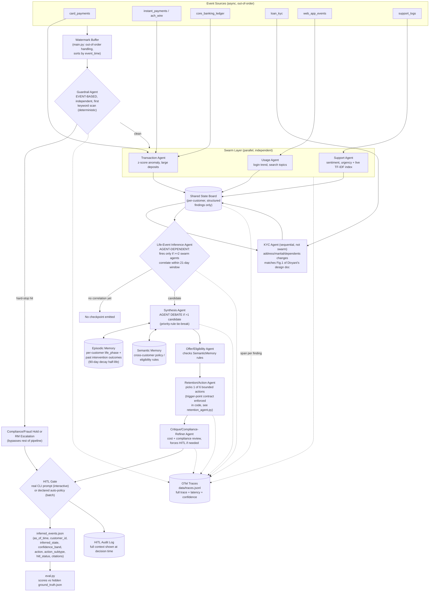

# System Architecture — Agentic Customer 360 Proactive Intervention Desk

## Diagram

This diagram follows the flow in Divyani's own design document
(`Proactive_Intervention_Desk`, Fig. 1): Stream Ingestion → Guardrail →
Swarm (Transaction/Usage/Support, parallel) → KYC (sequential, not part
of the swarm box) → Life-Event Inference → Synthesis → Offer/Eligibility
→ Retention/Action → Critique/Compliance-Refiner → HITL Checkpoint, with
control looping back to Guardrail for the next incoming event (the
left-hand return line in Fig. 1) — i.e. this is a continuous per-event
loop, not a one-shot pipeline. `main.py::Orchestrator.process_event` is
called once per event and re-enters at the guardrail check every time,
which is the code-level equivalent of that loop-back arrow.

## Synchronous vs. asynchronous flows
- **Synchronous (must happen immediately):** Guardrail keyword scan on
  every `support_logs`/`social_signal_consented` event (fraud/legal/
  self-harm hard-stop) — this is the authorization-time-equivalent
  fast path, and nothing else in the pipeline runs before it for that
  event.
- **Asynchronous (scheduled / background):** Usage Agent's daily rollup
  and KYC Agent's periodic re-verification are time-based triggers,
  independent of the live event stream (invoked by a scheduler, not
  shown as an edge above since they don't originate from an incoming
  event).

## Data source → tool → output per agent (also see the roster table in
the PDF, §5, which this implementation follows)

| Agent | Reads from | Tool(s) | Writes to |
|---|---|---|---|
| Guardrail | `support_logs`, `social_signal_consented` raw_text | `guardrails/keyword_scanner.py` (regex) | forced action -> HITL, StateBoard |
| Usage | `web_app_events` | rolling window trend calc, keyword topic map | StateBoard |
| Support | `support_logs` | lexicon sentiment, urgency scan, `memory/vector_rag.py` | StateBoard, live TF-IDF index |
| Transaction | `card_payments`, `instant_payments`/`ach_wire`, `core_banking_ledger` | Welford online z-score | StateBoard |
| KYC | `loan_kyc` | field-diff map | StateBoard |
| Life-Event | StateBoard (read-only, structured findings) | declarative correlation rule table | StateBoard, EpisodicMemory (read) |
| Synthesis | StateBoard, EpisodicMemory, SemanticMemory | priority-rule debate resolver | EpisodicMemory (`set_life_phase`), StateBoard |
| Offer | SemanticMemory | eligibility calculator | StateBoard |
| Retention | Synthesis output, Offer output, EpisodicMemory (past outcomes) | message templater | draft action |
| Critique | SemanticMemory | cost/compliance rule checker | HITL-required verdict |
| HITL | verdict + trace | CLI / auto-policy | `data/hitl_audit_log.jsonl`, `inferred_events.json` |

## Handoffs (explicit, scoped context per hop)
- Usage/Support/Transaction/KYC → StateBoard: each publishes only
  `{key, value, confidence, trace_id, source_event_ids}` — never a full
  reasoning trace (enforced in `state_board.py`).
- Life-Event → Synthesis: a single `candidate` dict
  (`inferred_state, confidence_band, evidence_keys, contributing_agents,
  source_event_ids`).
- Synthesis → Offer/Retention: `synthesis_result`
  (`inferred_state, confidence_band, citations`), not the full StateBoard.
- Retention → Critique: the drafted action dict; Critique appends
  `requires_hitl`/`critique_reasons` rather than rewriting the draft.
